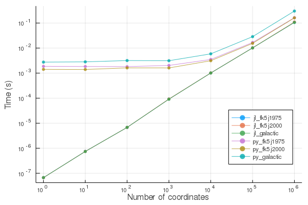

# SkyCoords.jl

[](https://travis-ci.org/JuliaAstro/SkyCoords.jl)
[](https://ci.appveyor.com/project/kbarbary/skycoords-jl/branch/master)
[](https://codecov.io/gh/JuliaAstro/SkyCoords.jl)

SkyCoords.jl provides a type system for astronomical coordinate systems with appropriate conversions between them.

## Installation
From the Julia REPL

```julia-repl
(v1.2) pkg> add SkyCoords

julia> using SkyCoords
```

```@meta
DocTestSetup = :(using SkyCoords)
```

## Usage

There are currently three supported coordinate systems. The following
immutable types are used to represent coordinates in each system:

- [`ICRSCoords`](@ref): ICRS coordinates system
- [`GalCoords`](@ref): Galactic coordinates system
- [`FK5Coords`](@ref): FK5 coordinates system (with arbitrary equninox)

Each type holds a longitude and latitude, and each is a subtype of
[`AbstractSkyCoords`](@ref).

```jldoctest
julia> c1 = ICRSCoords(0., 0.)  # inputs are ra, dec in radians
ICRSCoords{Float64}(0.0, 0.0)

julia> c1.ra # access ra, dec individually
0.0

julia> c2 = convert(GalCoords, c1) # convert to a different system
GalCoords{Float64}(1.6814027872278692, -1.0504884034813007)

julia> c2.l # Note that galactic coordinate fields are l, b
1.6814027872278692

julia> convert(FK5Coords{2000}, c1)
FK5Coords{2000,Float64}(1.1102233723050067e-7, 4.411803426976326e-8)

```

### Angular Separation between Coordinates

The [`separation`](@ref) function allows you to compute the angular (great-circle)
distance between two coordinates, in radians, using
the [Vincenty formula](http://en.wikipedia.org/wiki/Great-circle_distance).  The
coordinates can be also given in different systems.  For example, according to
SIMBAD the `FK5Coords{2000}` coordinates
of [Mizar](http://simbad.u-strasbg.fr/simbad/sim-id?Ident=MIZAR) are

```jldoctest sep
julia> mizar = FK5Coords{2000}(3.507787, 0.958628)
FK5Coords{2000,Float64}(3.507787, 0.958628)

```

while the `GalCoords` coordinates of Alcor are

```jldoctest sep
julia> alcor = GalCoords(1.968189, 1.072829)
GalCoords{Float64}(1.968189, 1.072829)

```

Their angular separation is given by

```jldoctest sep
julia> separation(mizar, alcor) # Radians
0.0034353091694529292

julia> rad2deg(separation(mizar, alcor)) * 60 # Arcminutes
11.8097230039347
```

## Accuracy

All the supported conversions have been compared to the results of
[astropy.coordinates](https://docs.astropy.org/en/stable/coordinates/) (to better than 0.0001 arcsec agreement for `Float64`).
In turn, [astropy.coordinates](https://docs.astropy.org/en/stable/coordinates/) has been tested against many other tools.

## Performance

For small and moderate numbers of coordinates, conversions are much
faster than [astropy.coordinates](https://docs.astropy.org/en/stable/coordinates/) in Python. The following plot shows the
performance for converting ICRS coordinates to various other systems
(Galactic, FK5J2000 and FK5J1975), using [astropy.coordinates](https://docs.astropy.org/en/stable/coordinates/) (`py_*`
labels) and SkyCoords.jl (`jl_*` labels). The x axis denotes the
number of coordinates being simultaneously converted, with 1
corresponding to scalar coordinates.



| Specs           |                                        |
|:----------------|:---------------------------------------|
| CPU             | Intel core i5-8259U @ 2.3GHz (4 cores) |
| RAM             | 16GB                                   |
| Julia Version   | 1.2                                    |
| Python Version  | 3.7                                    |
| Astropy Version | 3.1.2                                  |

For scalar coordinates, SkyCoords.jl is up to 100,000 times
faster. For very large vectors of one million coordinates or more,
SkyCoords.jl is 2-4 times faster.  The source code for these
benchmarks can be found in `bench/`.

## Contributing

If you would like to contribute to SkyCoords please head over to the [GitHub page](https://github.com/juliaastro/skycoords.jl) and file an issue or open a pull request!
